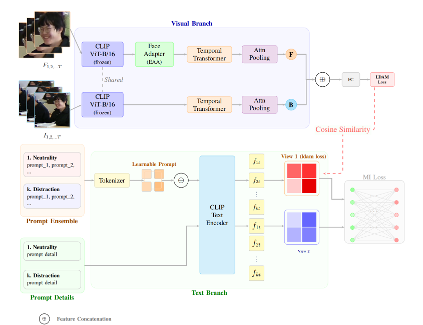

<p align="center">
  
</p>

<h1 align="center">RAPT-CLIP</h1>

<p align="center">
  <b>Recognition of Academic Emotions through Prompt-Tuned CLIP</b><br/>
  A dual-stream vision-language framework for real-time classroom emotion recognition
</p>

<p align="center">
  
  
  
  
  
</p>

---

## Overview

**RAPT-CLIP** is a multimodal emotion recognition framework that leverages pretrained CLIP (ViT-B/16) with learnable prompt tuning to recognize five academic emotions from classroom video: **Neutrality**, **Enjoyment**, **Confusion**, **Fatigue**, and **Distraction**.

### Key Contributions

- **Dual-Stream Architecture** — Separate face and body streams with an Expression-Aware Adapter (EAA) for face-specific feature refinement
- **Prompt Ensembling** — 3 hand-crafted prompts per class + learnable context vectors via CoOp-style prompt learning
- **Temporal Attention Pooling** — Transformer-based temporal aggregation with attention pooling to focus on "peak" emotion frames
- **LDAM + MI + DC Losses** — Label-Distribution-Aware Margin loss for class imbalance, Mutual Information loss for prompt alignment, Decorrelation loss for feature diversity
- **Real-time Inference** — Multi-threaded webcam pipeline with face detection for live classroom monitoring

---

## Architecture

| Component | Description |
|-----------|-------------|
| **CLIP ViT-B/16** | Pretrained vision-language backbone, fine-tuned image encoder |
| **Expression-Aware Adapter (EAA)** | Lightweight bottleneck adapter for face stream (512 → 128 → 512) |
| **Temporal Transformer** | 1-layer transformer + attention pooling over 16 temporal segments |
| **Prompt Learner** | 8 learnable context vectors per class with class-specific initialization |
| **Cosine Classifier** | Temperature-scaled cosine similarity between visual and text features |
| **LDAM Loss** | Margin-based loss with class-frequency-aware margins |
| **MI / DC Loss** | Regularization: align learnable ↔ hand-crafted prompts, reduce feature redundancy |

---

## Project Structure

```
RAPT-CLIP-RAER/
├── main.py                          # Entry point: training & evaluation
├── trainer.py                       # Training loop, validation, loss computation
├── models/
│   ├── Generate_Model.py            # Full RAPT-CLIP architecture (dual-stream)
│   ├── Generate_Model_NoText.py     # Visual-only ablation variant
│   ├── Prompt_Learner.py            # CoOp-style learnable prompt module
│   ├── Temporal_Model.py            # Temporal Transformer + Attention Pooling
│   ├── Text.py                      # Prompt templates for RAER, CAER-S, CK+, DAiSEE
│   ├── Adapter.py                   # Expression-Aware Adapter (EAA)
│   └── clip/                        # CLIP backbone
├── dataloader/
│   ├── video_dataloader.py          # Video dataset with face/body cropping
│   └── video_transform.py           # Group augmentations (ColorJitter, Rotation, etc.)
├── utils/
│   ├── builders.py                  # Model & dataloader factory
│   ├── loss.py                      # LDAM, MI, DC, LDL losses
│   └── utils.py                     # Metrics, checkpointing, plotting
├── train_sh/ablation/               # Shell scripts for training experiments
├── valid_sh/ablation/               # Shell scripts for validation experiments
├── RAER/                            # Dataset (annotations + bounding boxes)
│   ├── annotation/                  # train.txt, test.txt (video_path num_frames label)
│   └── bounding_box/               # face.json, body.json
├── run_realtime.py                  # Real-time webcam emotion recognition
├── run_thesis_gradcam_v2.py         # GradCAM / Attention heatmap visualization
├── run_gradcam_emotic.py            # GradCAM for EMOTIC dataset
├── run_tsne_rampdown.py             # t-SNE feature space visualization
├── evaluate_advanced_robustness.py  # Robustness testing (noise, occlusion, stream drop)
├── eval_tta.py                      # Test-Time Augmentation evaluation
└── outputs/                         # Checkpoints, logs, visualizations
    ├── RAER-ramp-down/              # Best RAER model (UAR 73.81%)
    ├── CAER-S/                      # CAER-S benchmark (UAR 91.48%)
    └── EMOTIC/                      # EMOTIC benchmark (mAP 31.20%)
```

---

## Installation

```bash
git clone https://github.com/mngoc3110/RAPT-CLIP.git
cd RAPT-CLIP

# Core dependencies
pip install torch torchvision
pip install ftfy regex tqdm scikit-learn matplotlib seaborn opencv-python

# Optional: for real-time face detection (higher quality than Haar Cascade)
pip install facenet-pytorch
```

**Requirements:** Python 3.8+, PyTorch 1.13+. Supports CUDA, Apple Silicon (MPS), and CPU.

---

## Training

### Quick Start (RAER Dataset)

```bash
bash train_sh/ablation/raer_full.sh
```

### Custom Training

```bash
python main.py \
  --mode train \
  --dataset RAER \
  --exper-name my-experiment \
  --epochs 25 \
  --batch-size 16 \
  --optimizer AdamW \
  --lr 2e-5 \
  --lr-image-encoder 1e-6 \
  --lr-prompt-learner 3e-4 \
  --lr-adapter 1e-4 \
  --loss-type ldam \
  --lambda_mi 0.1 \
  --lambda_dc 0.1 \
  --text-type prompt_ensemble \
  --num-segments 16 \
  --crop-body \
  --use-weighted-sampler \
  --use-amp
```

### Training Configuration

| Parameter | Value |
|-----------|-------|
| Backbone | CLIP ViT-B/16 |
| Optimizer | AdamW (weight decay 0.005) |
| Learning Rate | main: 2e-5, encoder: 1e-6, prompt: 3e-4, adapter: 1e-4 |
| Loss | LDAM (s=30, max_m=0.5) + MI (λ=0.1) + DC (λ=0.1) |
| Epochs | 25 |
| Batch Size | 16 |
| Temporal Sampling | 16 segments × 1 frame |
| Augmentation | ColorJitter, RandomGrayscale (p=0.2), Rotation (±4°), HorizontalFlip |
| Regularization | AMP, Gradient Clipping (1.0), MI/DC warmup (5 epochs) |

---

## Evaluation

### Standard Evaluation

```bash
python main.py \
  --mode eval \
  --dataset RAER \
  --eval-checkpoint outputs/RAER-ramp-down/model_best.pth \
  --test-annotation ./RAER/annotation/test.txt \
  --bounding-box-face ./RAER/bounding_box/face.json \
  --bounding-box-body ./RAER/bounding_box/body.json \
  --text-type prompt_ensemble \
  --crop-body
```

### Test-Time Augmentation (TTA)

```bash
python eval_tta.py \
  --checkpoint outputs/RAER-ramp-up/model_best.pth \
  --dataset RAER \
  --test-annotation ./RAER/annotation/test.txt
```

---

## Results

### Ablation Study on RAER Dataset

| Experiment | Description | UAR (%) |
|------------|-------------|---------|
| **RAER-ramp-down** | **Full model + MI/DC ramp-down** | **73.81** |
| RAER-ramp-up | Full model + MI/DC ramp-up | 73.76 |
| RAER-Freeze-encoder | Freeze CLIP image encoder | 71.56 |
| RAER-no-sampler | No WeightedRandomSampler | 71.20 |
| RAER-drop-path | DropPath 0.1 | 70.11 |
| RAER-cross-entropy | CrossEntropy (no LDAM) | 69.97 |
| RAER-no-mi-dc | No MI + DC losses | 69.30 |
| RAER-prompt-details | Prompt descriptors only | 68.62 |
| RAER-CLS-TOKEN | CLS token (no attention pooling) | 67.45 |

### Cross-Dataset Benchmarks

| Dataset | Classes | Metric | Score |
|---------|---------|--------|-------|
| **RAER** | 5 (Neutrality, Enjoyment, Confusion, Fatigue, Distraction) | UAR | **73.81%** |
| **CAER-S** | 7 (Anger, Disgust, Fear, Happy, Neutral, Sad, Surprise) | UAR | **91.48%** |
| **EMOTIC** | 26 continuous emotion categories | mAP | **31.20%** |
| **DAiSEE** | 3 (Disengaged, Engaged, Highly Engaged) | WAR | **57.94%** |

### Training Curves & Confusion Matrix

<p align="center">
  
  
</p>

<details>
<summary><b>CAER-S Results</b></summary>
<p align="center">
  
  
</p>
</details>

<details>
<summary><b>EMOTIC Results</b></summary>
<p align="center">
  
  
</p>
</details>

<details>
<summary><b>DAiSEE Results</b></summary>
<p align="center">
  
</p>
</details>

---

## Visualization

### t-SNE Feature Space Analysis

Compare feature distributions **before** and **after** fine-tuning:

```bash
python run_tsne_rampdown.py --checkpoint outputs/RAER-ramp-down/model_best.pth
```

<p align="center">
  
</p>
<p align="center"><em>Pretrained CLIP features — classes are completely mixed</em></p>

<p align="center">
  
</p>
<p align="center"><em>Fine-tuned features — clear class separation emerges</em></p>

### GradCAM / Attention Heatmap

Visualize model attention on face, body, and context regions:

```bash
python run_thesis_gradcam_v2.py
```

Uses token-level cosine similarity between CLIP patch tokens (14×14) and text embeddings to produce class-discriminative attention maps.

<p align="center">
  
  
</p>
<p align="center">
  
  
</p>
<p align="center">
  
</p>

### Robustness Analysis

```bash
python evaluate_advanced_robustness.py --checkpoint outputs/RAER-ramp-down/model_best.pth
```

Tests model resilience to: Gaussian noise, random erasing, temporal shuffling, face stream dropout, and body stream dropout.

---

## Real-Time Inference

Run live emotion recognition from webcam with multi-person support:

```bash
python run_realtime.py --checkpoint outputs/RAER-ramp-down/model_best.pth
```

**Features:**
- Haar Cascade face detection (or MTCNN if `facenet-pytorch` is installed)
- Batch inference for multiple faces simultaneously
- Multi-threaded pipeline (capture thread + inference thread)
- Real-time FPS counter and detection persistence
- Press `q` to quit

> **Note (macOS):** Grant camera permissions to Terminal in **System Settings → Privacy & Security → Camera**.

---

## RAER Dataset

### Emotion Classes

| ID | Class | Description |
|----|-------|-------------|
| 1 | **Neutrality** | Calm, passive, no visible emotion |
| 2 | **Enjoyment** | Engaged, interested, smiling |
| 3 | **Confusion** | Puzzled, furrowed brows, struggling to understand |
| 4 | **Fatigue** | Tired, drowsy, yawning, lowered head |
| 5 | **Distraction** | Looking away, checking phone, unfocused |

### Annotation Format

Each line in the annotation file:
```
video_path num_frames label
```

Example:
```
RAER/train/Neutral/001 150 1
RAER/train/Fatigue/003 120 4
```

### Bounding Box Format

JSON files mapping `video_key → frame_key → [x1, y1, x2, y2]`:

```json
{
  "RAER/train/Neutral/001": {
    "0.jpg": [120, 80, 280, 300],
    "1.jpg": [118, 82, 282, 298]
  }
}
```

---

## Citation

```bibtex
@misc{rapt-clip-2026,
  title   = {RAPT-CLIP: Recognition of Academic Emotions through Prompt-Tuned CLIP},
  author  = {Minh Ngoc},
  year    = {2026},
  note    = {Multimodal Academic Emotion Recognition with Vision-Language Pre-training}
}
```

---

## License

This project is for academic research purposes only.