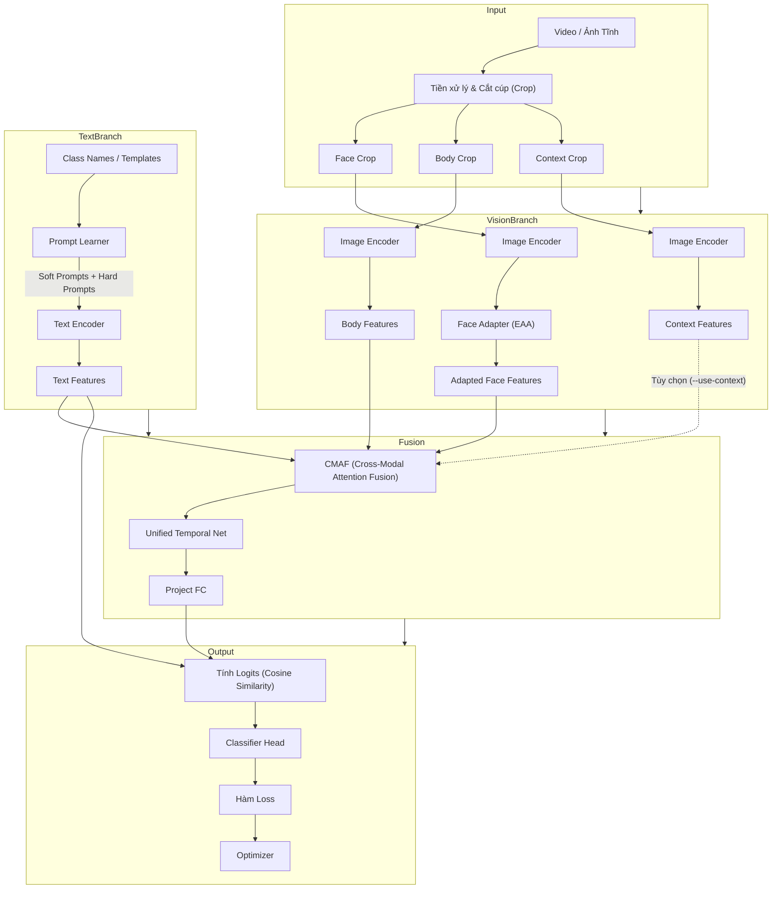

# BÁO CÁO PHÂN TÍCH KỸ THUẬT: KIẾN TRÚC RAPT-CLIP
**Dự án**: RAPT-CLIP (Robust Adapter and Prompt Tuning for CLIP-based Emotion Recognition)
**Mục tiêu**: Phân tích luồng hoạt động (Pipeline Workflow), cơ chế dung hợp đa phương thức và đối chiếu hiệu năng giữa hệ thống lõi (RAER) và hệ thống mở rộng đa nhãn (EMOTIC).

---

## 1. SƠ ĐỒ LUỒNG KIẾN TRÚC PIPELINE (PIPELINE WORKFLOW)

### 1.1. Luồng Dữ Liệu Tổng Thể (End-to-End Flow)

Dưới đây là sơ đồ kiến trúc End-to-End của mô hình RAPT-CLIP, biểu diễn quá trình trích xuất và dung hợp đặc trưng từ 2 nhánh: Thị giác (Vision) và Ngôn ngữ (Text).

### 1.2. Phân Tích Cơ Chế Tương Tác Đa Phương Thức

1. **Nhánh Thị giác (Visual Branch)**:
   - Dữ liệu được chia thành các luồng độc lập: **Face** (chứa biểu cảm vi mô), **Body** (chứa ngôn ngữ cơ thể), và **Context** (chứa bối cảnh môi trường).
   - Tất cả đi qua cùng một xương sống `ViT-B/16` (thường bị đóng băng hoặc unfreeze với learning rate cực nhỏ). Riêng đặc trưng khuôn mặt được đưa qua `Face Adapter` (Emotion-Aware Adapter) để tinh chỉnh độ nhạy cảm xúc.
2. **Nhánh Văn bản (Text Branch - Prompt Learner)**:
   - Thay vì dùng nhãn cứng (hard labels), mô hình sử dụng **Prompt Learner** để sinh ra các *soft prompts* (các vector có thể học được) kết hợp với *hard templates* (VD: *"A photo of a person showing {emotion}"*).
   - Sinh ra ma trận đặc trưng văn bản đại diện cho không gian ngữ nghĩa của toàn bộ các lớp cảm xúc.
3. **Cơ chế Dung hợp CMAF (Cross-Modal Attention Fusion)**:
   - Sử dụng cơ chế Attention chéo (Cross-Attention) để các luồng thị giác (Face, Body) trao đổi thông tin và tự động điều chỉnh trọng số. Ví dụ: Nếu khuôn mặt bị che khuất, cơ chế Attention sẽ dồn trọng số sang Body hoặc Context.
4. **Căn chỉnh Không gian (Text-Visual Alignment)**:
   - Thay vì dùng Fully Connected Layer để phân loại, mô hình tính tích vô hướng (Dot-product / Cosine Similarity) giữa Vector Đặc trưng Tổng hợp (từ luồng nhìn) và các Vector Văn bản.

---

## 2. SO SÁNH CƠ CHẾ: RAER (Hệ Lõi) VS. EMOTIC (Hệ Mở Rộng)

Dự án RAPT-CLIP ban đầu được thiết kế cho bài toán **nhận diện cảm xúc tĩnh/đơn nhãn (RAER, CAER)**. Khi mở rộng sang **EMOTIC (Đa nhãn, bối cảnh phức tạp)**, kiến trúc phải phân nhánh đáng kể.

| Tiêu chí | Hệ thống RAER (Cốt lõi) | Hệ thống EMOTIC (Mở rộng) |
| :--- | :--- | :--- |
| **Bản chất bài toán** | Single-label Multi-class (1 nhãn duy nhất mỗi video/ảnh) | Multi-label (1 ảnh có thể chứa nhiều cảm xúc + 3 chỉ số VAD) |
| **Không gian nhãn (Label Space)** | 5-8 lớp cảm xúc (Neutral, Happy, Anger, Sad...) | 26 lớp cảm xúc rời rạc (Discrete) + Không gian liên tục VAD |
| **Đầu vào Thị giác** | Face + Body (Ít phụ thuộc Context) | **Face + Body + Context** (Context đóng vai trò sinh tử) |
| **Text Prompting** | Mẫu câu ngắn, trực tiếp (VD: *"A person feeling happy"*) | **Rich Text Prompts**: Cần mô tả rất chi tiết các biến thể (VD: *"A person looking wistful, feeling yearning"*) |
| **Hàm Mất Mát (Loss Function)** | **Cross-Entropy** hoặc **LDAM** (chống mất cân bằng). | **Asymmetric Loss (ASL)** (Xử lý positive/negative imbalance) + BCEWithLogits. |
| **Chỉ số Đánh giá (Metrics)** | **WAR** (Weighted Acc), **UAR** (Unweighted Acc), Confusion Matrix. | **Macro mAP** (Mean Average Precision), Thresholds tối ưu F1 (Optimal Thresholding). |

> [!NOTE]
> Sự khác biệt lớn nhất nằm ở **không gian nhãn**: Các hàm Softmax/Cross-Entropy của RAER giả định các lớp cảm xúc loại trừ lẫn nhau (Mutually Exclusive). Đối với EMOTIC, các lớp có thể đồng thời xảy ra (Sigmoid + ASL).

---

## 3. PHÂN TÍCH ĐIỂM MẠNH (STRENGTHS) CỦA KIẾN TRÚC

1. **Khả năng tận dụng tri thức nền tảng (Foundation Knowledge)**:
   Sử dụng CLIP (ViT-B/16) pre-trained trên 400 triệu cặp ảnh-text giúp mô hình có sẵn khả năng hiểu ngữ nghĩa hình ảnh vượt trội mà không cần train lại từ đầu.
2. **Hiệu quả tham số (Parameter Efficiency)**:
   Bằng cách đóng băng bộ giải mã hình ảnh (Frozen Image Encoder) hoặc chỉ mở khóa với tốc độ học siêu nhỏ ($lr = 1e-6$), và chỉ tập trung cập nhật `Prompt Learner` ($lr = 3e-4$) cùng `Face Adapter`, hệ thống tiết kiệm được bộ nhớ GPU khổng lồ nhưng vẫn đạt tính đặc thù cao.
3. **Sức mạnh của CMAF (Cross-Modal Attention Fusion)**:
   Trong các video học trực tuyến (DAiSEE) hoặc ảnh bị che mặt (EMOTIC), khuôn mặt thường bị mờ hoặc quay đi. CMAF giúp mô hình linh hoạt chuyển đổi sự "chú ý" (attention) sang ngôn ngữ cơ thể hoặc bối cảnh xung quanh thay vì mù quáng tin vào đặc trưng khuôn mặt.
4. **Tính Tổng quát hóa cao (Generalization)**:
   Việc sử dụng Zero-Shot Text Prompts làm Classifier Head giúp mô hình dễ dàng chuyển giao sang các tập dữ liệu mới (DAiSEE, CAER) chỉ bằng cách đổi các câu Prompt mà không cần thiết kế lại toàn bộ mạng Neural.

---

## 4. ĐIỂM YẾU & ĐIỂM NGHẼN KỸ THUẬT (WEAKNESSES & BOTTLENECKS)

> [!WARNING]
> Mặc dù đạt Macro mAP 29.89% trên EMOTIC, kiến trúc vẫn bộc lộ các điểm nghẽn trí mạng, đặc biệt ở việc xử lý dữ liệu phức tạp.

1. **Vấn đề phân phối Đuôi Dài (Long-tail Imbalance) & Ngữ nghĩa trừu tượng**:
   - Các lớp mang tính trừu tượng, nội tâm cao như `Embarrassment` (F1 = 0%) hay `Yearning` (F1 = 11%) bị kẹt ở mức điểm rất thấp.
   - Nguyên nhân: Thiếu hụt trầm trọng số lượng mẫu dương (Positive Samples) và thiếu các tín hiệu thị giác (Visual Cues) rõ rệt mà ViT có thể bám vào.
2. **Độ nhạy cảm của Siêu tham số (Hyperparameter Sensitivity)**:
   - Các hàm loss phụ như **MI Loss** (Mutual Information) và **DC Loss** (Decoupling) nhằm tách bạch đặc trưng Face và Body. Tuy nhiên, nếu áp dụng với trọng số lớn (lambda cao), chúng gây **xung đột không gian gradient** (Gradient Conflict), làm sụp đổ quá trình hội tụ của ASL. (Bản v5 đã chứng minh việc TẮT MI/DC mang lại sự ổn định đột phá).
3. **Lỗ hổng Threshold (Ngưỡng Quyết Định)**:
   - Việc tính toán F1-Score trên EMOTIC phụ thuộc hoàn toàn vào việc dò tìm Threshold $t \in [0, 1]$. Đối với các lớp hiếm, tín hiệu dương quá yếu khiến mô hình không thể tìm được ngưỡng $t$ nào đủ phân tách Positive/Negative, dẫn đến rơi vào bẫy False Positive và đẩy F1 về 0.
4. **Chi phí tính toán đa luồng**:
   - Việc sử dụng cờ `--use-context` tạo ra luồng thứ 3 qua ViT. Một batch 8 video x 8 frames x 3 luồng = 192 ảnh nén qua ViT cùng lúc, dễ dàng làm tràn RAM (OOM) trên các GPU 16GB.

---

## 5. BÀI HỌC KINH NGHIỆM & HƯỚNG CẢI TIẾN TƯƠNG LAI

### Về Thuật toán và Kiến trúc
1. **Dynamic Thresholding & Tinh chỉnh ASL**:
   - Thay vì dùng ngưỡng cứng hoặc tìm kiếm tuần tự, có thể huấn luyện một mạng phụ (Threshold-Net) để dự đoán ngưỡng động (Dynamic Threshold) cho từng mẫu dựa trên Context.
   - Giảm tham số `gamma_neg` của ASL từ 3.0 xuống 2.0 hoặc 1.0 đối với các lớp quá hiếm để tránh việc hàm Loss bỏ qua hoàn toàn các mẫu khó.
2. **Tối ưu hóa Prompts (Visual Grounded Rich Prompts)**:
   - Kinh nghiệm từ bản v5 cho thấy: Thiết kế các câu lệnh (prompts) cực kỳ chi tiết, liên kết trực tiếp với các hành động cơ thể (VD: "che mặt", "nhăn mày") giúp CLIP đối chiếu dễ dàng hơn là dùng các từ cảm xúc trừu tượng ("xấu hổ").
3. **Kết hợp Knowledge Graph hoặc LLM**:
   - Đối với các lớp như `Embarrassment`, có thể tích hợp tri thức từ các LLM (như LLaMA/GPT) để tạo ra các đặc trưng text sâu sắc hơn, dẫn dắt nhánh Visual tìm đúng vị trí cần chú ý trong ảnh.
4. **Xử lý Dataloader Thông Minh**:
   - Để giảm OOM, có thể áp dụng `Gradient Accumulation` hoặc sử dụng cơ chế chia nhỏ luồng: Trích xuất Context ở độ phân giải thấp (112x112) và Face ở độ phân giải cao (224x224), vì bối cảnh thường không cần độ chi tiết vi mô.

---

## 6. CẬP NHẬT KIẾN TRÚC MỚI: GIẢI QUYẾT BÀI TOÁN "GIẰNG CO VECTOR" (VECTOR TUG-OF-WAR)

Khi áp dụng RAPT-CLIP nguyên bản lên EMOTIC, một vấn đề nghiêm trọng xuất hiện: **Hiện tượng Giằng co Vector**. Do kiến trúc cũ ép Face, Body, và Context thành 1 Vector duy nhất (Global Vector), các cảm xúc đối lập (như "buồn" ở mặt nhưng "vui" ở bối cảnh) sẽ tự triệt tiêu lẫn nhau. Để giải quyết, hai kiến trúc mới đã được bổ sung:

### 6.1. Kiến trúc Modality-Decoupled (Phân tách luồng thị giác)
- **Cơ chế**: Thay vì gộp 3 luồng thành 1, mô hình giữ nguyên 3 vector độc lập: $V_{face}, V_{body}, V_{context}$.
- **So khớp Logit-Max**: Tính điểm Cosine Similarity riêng biệt cho Face, Body, Context với Text. Nhãn nào có điểm cao nhất ở bất kỳ luồng nào sẽ được chọn (hàm `torch.max()`).
- **Ưu điểm**: Giữ nguyên được kiến trúc an toàn, dễ hội tụ. Giải quyết được bài toán "Giằng co" khi một cảm xúc chỉ xuất hiện ở một luồng duy nhất (VD: nhãn *Reading* chỉ xuất hiện ở Context).

### 6.2. Kiến trúc Query2Label (Q2L)
Đây là cuộc "đại phẫu" can thiệp trực tiếp vào lõi của Vision Transformer (ViT) để khai thác triệt để sức mạnh phân loại đa nhãn.
- **Can thiệp lõi ViT**: Thay vì vứt bỏ 196 mảnh ảnh (Patch Tokens) và chỉ giữ lại `[CLS] token` như ViT gốc, một hàm mới `forward_features()` được bổ sung để lấy trọn vẹn 196 mảnh ảnh.
- **Trạm kiểm soát LayerNorm**: Một lỗi nghiêm trọng thường gặp khi trích xuất Patch Tokens là bỏ qua lớp `self.ln_post`. Trong kiến trúc Q2L, lớp này được áp dụng nghiêm ngặt cho toàn bộ 196 patches để đảm bảo phân phối thống kê chuẩn xác trước khi chiếu (project) sang không gian đa phương thức.
- **Cross-Attention Multi-Label**: 26 nhãn cảm xúc được xem như 26 **Câu hỏi (Queries)** độc lập. Các Queries này sẽ rà quét qua kho dữ liệu khổng lồ gồm 394 mảnh ảnh (Face + Body) để tự "nhặt" thông tin thị giác phù hợp nhất với mình.
- **Chuẩn hóa L2 trước Dot-Product**: Để tránh việc hàm Loss bị tê liệt (Vanishing Gradient) do Logits nổ tung, `class_features` đầu ra của Attention được ép qua chuẩn hóa L2 Normalization trước khi tính tích vô hướng với Text Queries.

> [!TIP]
> **Sự linh hoạt**: Việc chuyển đổi giữa cấu trúc Cũ (CMAF/GFI) và Mới (Q2L/Decoupled) được kiểm soát hoàn toàn bằng cờ `--fusion-type` mà không gây phá vỡ luồng code của hệ thống cũ. Điều này giúp RAPT-CLIP trở thành một framework đa dụng cho cả bài toán Single-label (DAiSEE) và Multi-label (EMOTIC).
