# Systematic Workflow Analysis: RAPT-CLIP Vision-Language Model

> **Project**: RAPT-CLIP — Region-Aware Prompt-Tuned CLIP for Academic Emotion Recognition  
> **Architecture Class**: Dual/Triple-Stream VLM with Learnable Prompt Tuning  
> **Generated**: 2026-09-07

---

## 1. Multimodal Data Pipeline

### 1.1 Raw Input Ingestion

Dữ liệu đầu vào là **video** (hoặc thư mục frames), được xử lý bởi [`VideoDataset`](file:///Users/macbook/Downloads/RAPT-CLIP/dataloader/video_dataloader.py#L41-L357). Mỗi video được chia thành $T = 16$ segments (cấu hình qua `--num-segments`), mỗi segment lấy 1 frame (`--duration=1`).

**Ba luồng dữ liệu hình ảnh được trích xuất song song từ mỗi frame:**

| Luồng | Phương pháp trích xuất | Mục đích |
|:---|:---|:---|
| **Face** | Crop theo bounding box từ `face.json` + margin=10px | Micro-expressions (AU: mắt, lông mày, miệng) |
| **Body** | Full image hoặc crop body từ `body.json` | Posture, gestures (ngáp, chống cằm) |
| **Context** | Full original image (không crop) | Scene semantics (lớp học, bàn ghế) |

```
Frame_i → face.json lookup → Face Crop (tight margin=10)
        → body.json lookup → Body Crop (optional, full image fallback)  
        → No crop           → Context (original frame)
```

> [!IMPORTANT]
> **Fallback Strategy**: Khi không tìm thấy bounding box (face/body), hệ thống trả về **ảnh gốc** thay vì ảnh đen — tránh mất thông tin, đặc biệt quan trọng ở test set. Logic tại [video_dataloader.py:L104-L109](file:///Users/macbook/Downloads/RAPT-CLIP/dataloader/video_dataloader.py#L104-L109).

### 1.2 Frame Sampling Strategy

| Chế độ | Thuật toán | Mô tả |
|:---|:---|:---|
| **Train** | [`_get_train_indices`](file:///Users/macbook/Downloads/RAPT-CLIP/dataloader/video_dataloader.py#L154-L165) | Chia video thành $T$ segments đều, random sample 1 frame trong mỗi segment → **Temporal Jittering** |
| **Test** | [`_get_test_indices`](file:///Users/macbook/Downloads/RAPT-CLIP/dataloader/video_dataloader.py#L167-L176) | Chọn frame **giữa** mỗi segment → Deterministic, reproducible |

### 1.3 Data Augmentation Pipeline

**Training transforms** ([video_dataloader.py:L362-L370](file:///Users/macbook/Downloads/RAPT-CLIP/dataloader/video_dataloader.py#L362-L370)):

```
ColorJitter(brightness=0.5, contrast=0.5, saturation=0.5, hue=0.2)
  → GroupRandomGrayscale(p=0.2)      # Force geometry/pose focus
  → RandomRotation(4°)
  → GroupResize(224)
  → GroupRandomHorizontalFlip()
  → Stack() → ToTorchFormatTensor()
```

**Test transforms**: Chỉ `GroupResize → Stack → ToTorchFormat` (no augmentation).

> [!NOTE]
> Cả 3 luồng (Face, Body, Context) đều chia sẻ **cùng một transform pipeline** — đảm bảo alignment không gian nhất quán.

### 1.4 Chiến lược xử lý mất cân bằng nhãn

Hệ thống cung cấp **3 tầng** xử lý imbalance:

| Tầng | Kỹ thuật | Cơ chế |
|:---|:---|:---|
| **Dataloader** | [`WeightedRandomSampler`](file:///Users/macbook/Downloads/RAPT-CLIP/utils/builders.py#L166-L179) | Oversample minority classes dựa trên `1/class_count` |
| **Loss Function** | **LDAM Loss** ([loss.py:L128-L152](file:///Users/macbook/Downloads/RAPT-CLIP/utils/loss.py#L128-L152)) | Margin-based: class hiếm → margin lớn hơn |
| **Loss Function** | **Label Smoothing** ([LSR2](file:///Users/macbook/Downloads/RAPT-CLIP/utils/loss.py#L52-L77)) | Soft targets giảm overfitting trên class majority |
| **Data Augmentation** | **Mixup** ([trainer.py:L99-L111](file:///Users/macbook/Downloads/RAPT-CLIP/trainer.py#L99-L111)) | Tạo virtual samples bằng nội suy tuyến tính |

### 1.5 Text Data Pipeline (Prompt Engineering)

Văn bản được định nghĩa tĩnh trong [`Text.py`](file:///Users/macbook/Downloads/RAPT-CLIP/models/Text.py) với nhiều cấp độ chi tiết:

| Loại Prompt | Ví dụ (class Fatigue) | Dùng cho |
|:---|:---|:---|
| `class_names` | `"Fatigue"` | Baseline đơn giản |
| `class_names_with_context` | `"A student shows fatigue during learning..."` | Contextual |
| `class_descriptor` (Face) | `"drooping eyelids, frequent yawning, sleepy face"` | **MI Loss anchor** |
| `prompt_ensemble` | 3 phiên bản mô tả / class | **Ensemble averaging** |
| `au_guided` | `"AU43 eyes closed and AU46 drooping eyelids"` | Action Unit guided |

**Prompt Ensemble** ([Generate_Model.py:L16-L24](file:///Users/macbook/Downloads/RAPT-CLIP/models/Generate_Model.py#L16-L24)): Mỗi class có $P=3$ prompts → flatten thành $C \times P$ prompts → logits được **average** qua $P$ chiều trước khi classification.

---

## 2. Multimodal Representation & Fusion

### 2.1 Vision Encoder: Shared CLIP ViT-B/16

```
                    ┌─────────────────────┐
Face Frames ──────→ │                     │──→ face_features  (B*T, 512)
                    │  CLIP ViT-B/16      │
Body Frames ──────→ │  (Shared Weights)   │──→ body_features  (B*T, 512)
                    │                     │
Context Frames ──→ │  Patch=16, Dim=768  │──→ ctx_features   (B*T, 512)
                    └─────────────────────┘
```

- **Backbone**: ViT-B/16 pretrained trên 400M image-text pairs (CLIP).
- **Weight Sharing**: Cả 3 streams dùng **cùng một encoder** → giảm #params, duy trì unified visual understanding.
- **Fine-tuning**: LR riêng biệt (`--lr-image-encoder=1e-6`) hoặc freeze hoàn toàn (`--freeze-image-encoder`).
- **Stochastic Depth**: Drop-path rate configurable (`--drop-path-rate`) để regularize backbone.

### 2.2 Expression-Aware Adapter (EAA)

[`Adapter`](file:///Users/macbook/Downloads/RAPT-CLIP/models/Adapter.py) — Chỉ áp dụng cho **Face stream**:

$$\text{EAA}(x) = \text{Dropout}\big(\text{ReLU}\big(W_2 \cdot \text{Dropout}\big(\text{ReLU}(W_1 \cdot x)\big)\big)\big)$$

- **Bottleneck**: 512 → 128 → 512 (reduction=4)
- **Mục đích**: Adapt CLIP features (general-purpose) thành expression-sensitive features mà **không ghi đè** foundational knowledge
- **Dropout 0.5**: Ngăn overfitting trên face stream (dữ liệu face thường ít diverse hơn body)

```python
image_face_features = self.image_encoder(face_images)   # CLIP features
image_face_features = self.face_adapter(face_features)   # EAA adapted
# Body stream: NO adapter → pure CLIP features
image_body_features = self.image_encoder(body_images)
```

### 2.3 Text Encoder: CoOp Prompt Learner

[`PromptLearner`](file:///Users/macbook/Downloads/RAPT-CLIP/models/Prompt_Learner.py#L28-L138) triển khai **Context Optimization (CoOp)**:

$$\text{prompt}_i = [\text{SOS}] \oplus [v_1, v_2, ..., v_M] \oplus [\text{class}_i] \oplus [\text{EOS}]$$

Trong đó $\{v_j\}_{j=1}^{M}$ là $M=8$ learnable context vectors (mỗi vector có dim=512).

**Các chế độ vị trí class token:**

| Position | Format | Cấu trúc |
|:---|:---|:---|
| `end` (default) | `[SOS][ctx₁...ctx₈][CLASS][EOS]` | Standard CoOp |
| `middle` | `[SOS][ctx₁...ctx₄][CLASS][ctx₅...ctx₈][EOS]` | Split context |
| `front` | `[SOS][CLASS][ctx₁...ctx₈][EOS]` | Class-first |

**Class-Specific vs Generic Context**:
- `class_specific_contexts=True`: Mỗi class $i$ có riêng $M$ context vectors → shape `(C, M, D)`
- `class_specific_contexts=False`: Tất cả classes chia sẻ $M$ vectors → shape `(M, D)` broadcast thành `(C, M, D)`

[`TextEncoder`](file:///Users/macbook/Downloads/RAPT-CLIP/models/Prompt_Learner.py#L7-L26) chạy prompts qua CLIP Transformer, trích xuất feature tại vị trí **EOT token**:

```python
x = prompts + positional_embedding    # (C, L, D)
x = CLIP_Transformer(x)               # (C, L, D)  
x = x[arange(C), eot_positions] @ text_projection  # (C, 512)
```

> [!IMPORTANT]
> Text Encoder luôn chạy ở **FP32** (force cast) để tránh NaN trên MPS/Apple Silicon — xem [Generate_Model.py:L258](file:///Users/macbook/Downloads/RAPT-CLIP/models/Generate_Model.py#L258).

### 2.4 Cross-Modal Attention Fusion (CMAF)

[`CrossModalAttentionFusion`](file:///Users/macbook/Downloads/RAPT-CLIP/models/CrossModalAttentionFusion.py) — Module hợp nhất cốt lõi:

#### Mode 2-Stream (Face + Body):

$$\text{face\_out} = \text{LN}\Big(\text{CrossAttn}(Q{=}f, K{=}b, V{=}b) + f\Big)$$
$$\text{body\_out} = \text{LN}\Big(\text{CrossAttn}(Q{=}b, K{=}f, V{=}f) + b\Big)$$
$$\text{fused} = [\text{face\_out} \| \text{body\_out}] \in \mathbb{R}^{1024}$$

#### Mode 3-Stream (Face + Body + Context):

$$\text{face\_out} = \text{LN}\Big(\text{CrossAttn}\big(Q{=}f,\; K{=}[b \| c],\; V{=}[b \| c]\big) + f\Big)$$
$$\text{body\_out} = \text{LN}\Big(\text{CrossAttn}\big(Q{=}b,\; K{=}[f \| c],\; V{=}[f \| c]\big) + b\Big)$$
$$\text{ctx\_out} = \text{LN}\Big(\text{CrossAttn}\big(Q{=}c,\; K{=}[f \| b],\; V{=}[f \| b]\big) + c\Big)$$
$$\text{fused} = [\text{face\_out} \| \text{body\_out} \| \text{ctx\_out}] \in \mathbb{R}^{1536}$$

**Thiết kế quan trọng:**
- **Bidirectional/Tridirectional**: Mỗi modality attend sang tất cả modalities còn lại
- **Residual connections** + **LayerNorm**: Ổn định gradient flow
- **Xavier init**: Uniform init cho attention projections → tránh vanishing/exploding attention scores
- **4 attention heads**: Cho phép capture đa dạng cross-modal relationships

#### Alternative: Gated Feature Integration (GFI)

```python
fused = concat(face, body, [context])     # (B*T, 1024 or 1536)
gate = sigmoid(MLP(fused))                # Learned importance gate
fused = fused * gate                      # Element-wise gating
```

### 2.5 Temporal Transformer với Attention Pooling

[`Temporal_Transformer_AttnPool`](file:///Users/macbook/Downloads/RAPT-CLIP/models/Temporal_Model.py#L178-L222):

```
Fused frame features: (B, T=16, D)
     ↓ + Positional Embedding
     ↓ Transformer(depth=1, heads=8, dim_head=64)
     ↓ Self-attention across 16 frames
     ↓ 
     ↓ Attention Pooling:
     │   scores = Tanh(Linear(Linear(x)))    → (B, 16, 1)
     │   weights = Softmax(scores, dim=1)    → (B, 16, 1)  
     │   output = weights^T @ x              → (B, 1, D)
     ↓
Video-level feature: (B, D)  →  project_fc  →  (B, 512)
```

**Tại sao Attention Pooling thay vì Mean/CLS?**
- Mean pooling: Treat all frames equally → miss emotional peaks
- CLS token: Requires more depth to propagate information
- **Attention Pooling**: Dynamically learns $\alpha_t$ per frame → tập trung vào moments có emotional intensity cao nhất (e.g., khoảnh khắc ngáp, cau mày)

### 2.6 Classification: Vision-Language Alignment

$$\text{logits} = \frac{v \cdot T^\top}{\tau}$$

Trong đó:
- $v \in \mathbb{R}^{B \times 512}$: video features (L2-normalized)
- $T \in \mathbb{R}^{C \times 512}$: text features (L2-normalized)  
- $\tau = 0.07$: temperature

**Prompt Ensemble mode** ([Generate_Model.py:L296-L307](file:///Users/macbook/Downloads/RAPT-CLIP/models/Generate_Model.py#L296-L307)):

$$\text{logits}_{b,c} = \frac{1}{P} \sum_{p=1}^{P} \frac{v_b \cdot T_{c,p}}{\tau}$$

---

## 3. Loss Dynamics & Optimization Strategy

### 3.1 Primary Classification Loss

Hệ thống hỗ trợ **4 loại** classification loss có thể swap dễ dàng:

#### (a) Cross-Entropy (CE) — Baseline
$$\mathcal{L}_{CE} = -\sum_c y_c \log \hat{p}_c$$

#### (b) Label Smoothing Regularization (LSR2)
$$\mathcal{L}_{LSR} = (1-\epsilon)\mathcal{L}_{CE} + \epsilon \cdot \Big(-\frac{1}{C}\sum_c \log \hat{p}_c\Big)$$

Với $\epsilon = 0.05$ mặc định. Giảm overconfident predictions.

#### (c) LDAM Loss — Label-Distribution-Aware Margin
[`LDAMLoss`](file:///Users/macbook/Downloads/RAPT-CLIP/utils/loss.py#L128-L152):

$$\Delta_j = \frac{C}{\sqrt[4]{n_j}}, \quad \mathcal{L}_{LDAM} = -\log \frac{e^{s(z_y - \Delta_y)}}{e^{s(z_y - \Delta_y)} + \sum_{j \neq y} e^{sz_j}}$$

- $n_j$: số samples của class $j$
- $\Delta_y$: margin tỷ lệ nghịch với $n_y^{1/4}$ → class hiếm nhận margin lớn hơn
- $s = 30$: scaling factor (đã tune cho CLIP cosine-sim outputs)

> [!WARNING]
> **Double-Scaling Trap**: LDAM `s=30` × CLIP `temperature=0.07` → effective scale = 428.6! Cần cẩn thận điều chỉnh. Xem [training_optimization_master.md](file:///Users/macbook/.gemini/antigravity-ide/knowledge/raer_clip_emotion_recognition_toolkit/artifacts/optimization/training_optimization_master.md#L79-L89).

#### (d) Semantic Label Distribution Learning (SemanticLDL)
[`SemanticLDLLoss`](file:///Users/macbook/Downloads/RAPT-CLIP/utils/loss.py#L154-L189):

$$\mathcal{L}_{LDL} = \text{KL}\Big(\text{softmax}\big(\frac{\text{logits}}{\tau_1}\big) \| \text{softmax}\big(\frac{\text{sim}(T, T^\top)}{\tau_2}\big)[y]\Big)$$

Soft targets sinh từ **cosine similarity giữa các text prototypes** — class gần nhau về ngữ nghĩa (e.g., Neutral ↔ Fatigue) nhận shared probability mass.

### 3.2 Auxiliary Losses

#### (a) Mutual Information (MI) Loss — Text Alignment
[`MILoss`](file:///Users/macbook/Downloads/RAPT-CLIP/utils/loss.py#L26-L50):

$$\mathcal{L}_{MI} = \frac{1}{2}\Big[\text{CE}\big(\frac{T_L \cdot T_H^\top}{\tau}, I\big) + \text{CE}\big(\frac{T_H \cdot T_L^\top}{\tau}, I\big)\Big]$$

- $T_L$: Learnable text features (CoOp output)
- $T_H$: Hand-crafted text features (frozen semantic anchors)
- $I$: Identity matrix (diagonal = positive pairs)
- **Mục đích**: Ngăn **semantic drift** — learnable prompts phải remain aligned với hand-crafted descriptors

#### (b) Decorrelation (DC) Loss — Class Separability  
[`DCLoss`](file:///Users/macbook/Downloads/RAPT-CLIP/utils/loss.py#L9-L24):

$$\mathcal{L}_{DC} = \frac{\|T_L \cdot T_L^\top - I\|_F^2}{C(C-1)}$$

**Mục đích**: Minimize cosine similarity giữa các class text features → tăng inter-class separability.

#### (c) MoCo Contrastive Loss — Self-supervised Representation
[Generate_Model.py:L275-L292](file:///Users/macbook/Downloads/RAPT-CLIP/models/Generate_Model.py#L275-L292):

$$\mathcal{L}_{MoCo} = -\log \frac{e^{q \cdot k^+ / \tau}}{e^{q \cdot k^+ / \tau} + \sum_{k^-} e^{q \cdot k^- / \tau}}$$

- **Query**: Video feature từ online encoder
- **Key+**: Video feature từ momentum encoder (same sample)
- **Key-**: Features từ memory queue ($K=4096$)
- **Momentum update**: $\theta_m \leftarrow 0.99 \cdot \theta_m + 0.01 \cdot \theta_q$

### 3.3 Tổng hợp Total Loss

$$\boxed{\mathcal{L}_{total} = \mathcal{L}_{cls} + \lambda_{MI}(e) \cdot \mathcal{L}_{MI} + \lambda_{DC}(e) \cdot \mathcal{L}_{DC} + \mathbb{1}_{moco} \cdot \mathcal{L}_{MoCo}}$$

**Dynamic Weight Scheduling** ([utils.py:L14-L37](file:///Users/macbook/Downloads/RAPT-CLIP/utils/utils.py#L14-L37)):

```
λ(epoch) = ┌ 0                                    if epoch < warmup
           │ λ_final × (epoch - warmup) / ramp     if warmup ≤ epoch < warmup + ramp  
           └ λ_final                                if epoch ≥ warmup + ramp
```

| Loss | Default λ | Warmup | Ramp | Strategy |
|:---|:---|:---|:---|:---|
| MI | 0.1 | 5 epochs | 10 epochs | Ramp-up hoặc Ramp-down |
| DC | 0.1 | 5 epochs | 10 epochs | Ramp-up |
| MoCo | 1.0 | 0 | 0 | Constant |

### 3.4 Chiến lược Learning Rate Đa Tầng

[main.py:L281-L293](file:///Users/macbook/Downloads/RAPT-CLIP/main.py#L281-L293) — Per-component LR:

| Component | Default LR | Rationale |
|:---|:---|:---|
| `image_encoder` (ViT) | **1e-6** | Near-frozen, preserve CLIP knowledge |
| `prompt_learner` (CoOp) | **2e-4** | New params, cần học nhanh |
| `face_adapter` (EAA) | **1e-4** | Lightweight adapter |
| `unified_temporal_net` | **2e-5** | New transformer layers |
| `project_fc`, `cmaf` | **2e-5** | Fusion + projection |

**Scheduler**: `MultiStepLR` with milestones [10, 15], γ=0.1  
**Optimizer**: AdamW (weight_decay=0.005)

### 3.5 Regularization Arsenal

| Technique | Config | Location |
|:---|:---|:---|
| **EMA** (decay=0.999) | [`ModelEMA`](file:///Users/macbook/Downloads/RAPT-CLIP/trainer.py#L14-L37) | Update after each step, apply at validation |
| **Mixup** (α configurable) | [trainer.py:L99-L111](file:///Users/macbook/Downloads/RAPT-CLIP/trainer.py#L99-L111) | Both Face and Body streams mixed |
| **Drop-path** | `--drop-path-rate` | ViT backbone stochastic depth |
| **Gradient Clipping** | max_norm=1.0 | [trainer.py:L288](file:///Users/macbook/Downloads/RAPT-CLIP/trainer.py#L288) |
| **Dropout 0.5** | Adapter, Temporal | Heavy dropout on adapters |
| **AMP** (optional) | GradScaler | FP16 training for speed |

---

## 4. Workflow Diagram

```mermaid
flowchart TB
    subgraph INPUT["📥 Raw Inputs"]
        V["Video / Frame Directory"]
        BB_F["face.json<br/>(Bounding Boxes)"]
        BB_B["body.json<br/>(Bounding Boxes)"]
    end

    subgraph DATALOADER["📦 VideoDataset"]
        direction TB
        V --> SAMPLE["Temporal Sampling<br/>T=16 segments"]
        SAMPLE --> CROP_F["Face Crop<br/>(margin=10px)"]
        SAMPLE --> CROP_B["Body Crop<br/>(full image fallback)"]
        SAMPLE --> CROP_C["Context<br/>(original frame)"]
        BB_F --> CROP_F
        BB_B --> CROP_B
        
        CROP_F --> AUG["Group Augmentation<br/>ColorJitter + Grayscale<br/>+ Rotation + HFlip"]
        CROP_B --> AUG
        CROP_C --> AUG
        
        AUG --> TENSOR_F["Face Tensor<br/>(T, 3, 224, 224)"]
        AUG --> TENSOR_B["Body Tensor<br/>(T, 3, 224, 224)"]
        AUG --> TENSOR_C["Context Tensor<br/>(T, 3, 224, 224)"]
    end

    subgraph ENCODER["🔬 Shared CLIP ViT-B/16"]
        TENSOR_F --> VIT["ViT-B/16<br/>Patch=16, Dim=768<br/>→ CLS token → 512-d"]
        TENSOR_B --> VIT
        TENSOR_C --> VIT
        VIT --> FEAT_F["Face Features<br/>(B×T, 512)"]
        VIT --> FEAT_B["Body Features<br/>(B×T, 512)"]
        VIT --> FEAT_C["Context Features<br/>(B×T, 512)"]
    end

    subgraph ADAPT["🔧 Face Adaptation"]
        FEAT_F --> EAA["EAA Adapter<br/>512→128→512<br/>+ Dropout 0.5"]
        EAA --> FEAT_F_A["Adapted Face<br/>(B×T, 512)"]
    end

    subgraph FUSION["🔀 Cross-Modal Attention Fusion (CMAF)"]
        direction TB
        FEAT_F_A --> CA1["Face(Q) × Body+Ctx(K,V)<br/>MultiheadAttn 4-head"]
        FEAT_B --> CA2["Body(Q) × Face+Ctx(K,V)<br/>MultiheadAttn 4-head"]
        FEAT_C --> CA3["Ctx(Q) × Face+Body(K,V)<br/>MultiheadAttn 4-head"]
        CA1 --> LN1["LayerNorm + Residual"]
        CA2 --> LN2["LayerNorm + Residual"]
        CA3 --> LN3["LayerNorm + Residual"]
        LN1 --> CONCAT["Concat<br/>→ (B×T, 1536)"]
        LN2 --> CONCAT
        LN3 --> CONCAT
    end

    subgraph TEMPORAL["⏱️ Temporal Modeling"]
        CONCAT --> RESHAPE["Reshape<br/>(B, T=16, 1536)"]
        RESHAPE --> POS["+ Positional<br/>Embedding"]
        POS --> TF["Transformer<br/>depth=1, heads=8"]
        TF --> ATTN_POOL["Attention Pooling<br/>Learned α_t weights"]
        ATTN_POOL --> VIDEO_F["Video Feature<br/>(B, 1536)"]
        VIDEO_F --> PROJ["Linear Projection<br/>1536 → 512"]
        PROJ --> NORM_V["L2 Normalize<br/>(B, 512)"]
    end

    subgraph TEXT["📝 Dual-Prompt Text Encoding"]
        direction TB
        PROMPT_L["CoOp Learnable Prompts<br/>[SOS][v₁...v₈][CLASS][EOS]<br/>× C classes × P prompts"]
        PROMPT_H["Hand-crafted Descriptors<br/>(frozen semantic anchors)"]
        PROMPT_L --> TE["CLIP Text Transformer<br/>(FP32 forced)"]
        PROMPT_H --> TE
        TE --> TEXT_L["Learnable Text Features<br/>(C×P, 512) → avg → (C, 512)"]
        TE --> TEXT_H["Hand-crafted Text Features<br/>(C, 512)"]
    end

    subgraph CLASSIFY["📊 Classification"]
        NORM_V --> COSINE["Cosine Similarity<br/>logits = v · T^⊤ / τ"]
        TEXT_L --> COSINE
        COSINE --> LOGITS["Logits (B, C)"]
    end

    subgraph LOSS["⚡ Loss Computation"]
        LOGITS --> CLS_LOSS["Classification Loss<br/>CE / LSR / LDAM / LDL"]
        TEXT_L --> MI["MI Loss<br/>align learnable↔handcrafted"]
        TEXT_H --> MI
        TEXT_L --> DC["DC Loss<br/>decorrelate class features"]
        NORM_V --> MOCO["MoCo Loss<br/>contrastive queue"]
        
        CLS_LOSS --> TOTAL["𝓛_total = 𝓛_cls<br/>+ λ_MI · 𝓛_MI<br/>+ λ_DC · 𝓛_DC<br/>+ 𝓛_MoCo"]
        MI --> TOTAL
        DC --> TOTAL
        MOCO --> TOTAL
    end

    subgraph OPTIM["🎯 Optimization"]
        TOTAL --> BACKPROP["Backprop + Grad Clip<br/>max_norm=1.0"]
        BACKPROP --> ADAMW["AdamW<br/>Per-component LR"]
        ADAMW --> EMA_UP["EMA Update<br/>decay=0.999"]
        ADAMW --> SCHED["MultiStepLR<br/>milestones=[10,15]"]
    end

    style INPUT fill:#1a1a2e,stroke:#e94560,color:#fff
    style DATALOADER fill:#16213e,stroke:#0f3460,color:#fff
    style ENCODER fill:#0f3460,stroke:#533483,color:#fff
    style ADAPT fill:#533483,stroke:#e94560,color:#fff
    style FUSION fill:#e94560,stroke:#f5c518,color:#fff
    style TEMPORAL fill:#f5c518,stroke:#0f3460,color:#000
    style TEXT fill:#0f3460,stroke:#533483,color:#fff
    style CLASSIFY fill:#533483,stroke:#e94560,color:#fff
    style LOSS fill:#e94560,stroke:#f5c518,color:#fff
    style OPTIM fill:#16213e,stroke:#0f3460,color:#fff
```



---

## 5. Scientific Summary

### 5.1 Core Novelty — So sánh với VLM Baselines

| Aspect | CLIP Zero-shot | CLIP Linear Probe | **RAPT-CLIP (Ours)** |
|:---|:---|:---|:---|
| **Visual Input** | Single image | Single image | **Multi-region × Multi-frame** (Face + Body + Context × T frames) |
| **Text Prompts** | Fixed template `"a photo of {class}"` | None (linear head) | **Learnable CoOp + Prompt Ensemble + Hand-crafted anchors** |
| **Cross-modal Fusion** | None | None | **Bidirectional/Tridirectional CMAF** |
| **Temporal Modeling** | None | None | **Transformer + Attention Pooling** |
| **Imbalance Handling** | None | CE only | **LDAM + WeightedSampler + Mixup** |
| **Regularization** | None | Minimal | **EMA + Drop-path + Grad Clip + Modality Dropout** |

### 5.2 Đóng góp khoa học cốt lõi

> [!TIP]
> **5 đóng góp chính** phân biệt RAPT-CLIP với các VLM chuẩn:

1. **Region-Aware Multi-Stream Architecture**: Thay vì xử lý toàn bộ ảnh như một input duy nhất, hệ thống **phân tách có chủ đích** thành Face (micro-expression) / Body (posture) / Context (scene), cho phép mỗi stream tập trung vào cues khác nhau mà CLIP pretrained chưa đủ tinh.

2. **Expression-Aware Adapter (EAA)**: Bottleneck adapter chỉ cho face stream — giải quyết **domain gap** giữa CLIP (trained on web images) và classroom face expressions (subtle, low-resolution), trong khi body/context giữ nguyên CLIP features.

3. **Cross-Modal Attention Fusion (CMAF)**: Thay vì simple concat/mean, CMAF cho phép mỗi modality **query thông tin từ modalities khác** trước khi fusion. Face biết posture context → phân biệt "neutral đang ngồi yên" vs "neutral đang lim dim". Body biết facial expression → phân biệt "chống cằm vì chán" vs "chống cằm vì suy nghĩ".

4. **Dual-Prompt Learning System**: Kết hợp (a) learnable CoOp prompts cho flexibility, (b) hand-crafted semantic descriptors làm anchors, (c) MI Loss để align chúng → ngăn semantic drift mà vẫn cho phép adaptation. Prompt Ensemble qua P descriptions tăng robustness.

5. **Hierarchical Loss System với Dynamic Scheduling**: Tổ hợp LDAM (class-aware margin) + MI (semantic alignment) + DC (feature decorrelation) + MoCo (contrastive), mỗi loss có **independent warmup/ramp schedule** → tránh interference giữa các objectives trong early training.

### 5.3 Thiết kế kiến trúc đặc biệt

```
┌─────────────────────────────────────────────────────────────────┐
│ Novelty Stack:                                                  │
│                                                                 │
│  [1] Multi-Region Decomposition (Face/Body/Context)             │
│       ↓                                                         │
│  [2] Asymmetric Adaptation (EAA chỉ cho Face)                  │
│       ↓                                                         │
│  [3] Tridirectional Cross-Attention Fusion (CMAF)               │
│       ↓                                                         │
│  [4] Temporal Attention Pooling (learned frame importance)      │
│       ↓                                                         │
│  [5] Vision-Language Alignment via Dual-Prompt System           │
│       ↓                                                         │
│  [6] Multi-Objective Loss with Dynamic Scheduling               │
└─────────────────────────────────────────────────────────────────┘
```

> [!NOTE]
> **Key Insight**: RAPT-CLIP không cố gắng thay đổi CLIP — nó **bổ sung khả năng** cho CLIP bằng cách thêm region awareness, temporal modeling, và cross-modal reasoning trên nền tảng frozen/lightly-tuned CLIP backbone. Đây là chiến lược **parameter-efficient adaptation** phù hợp với limited academic computing resources.
